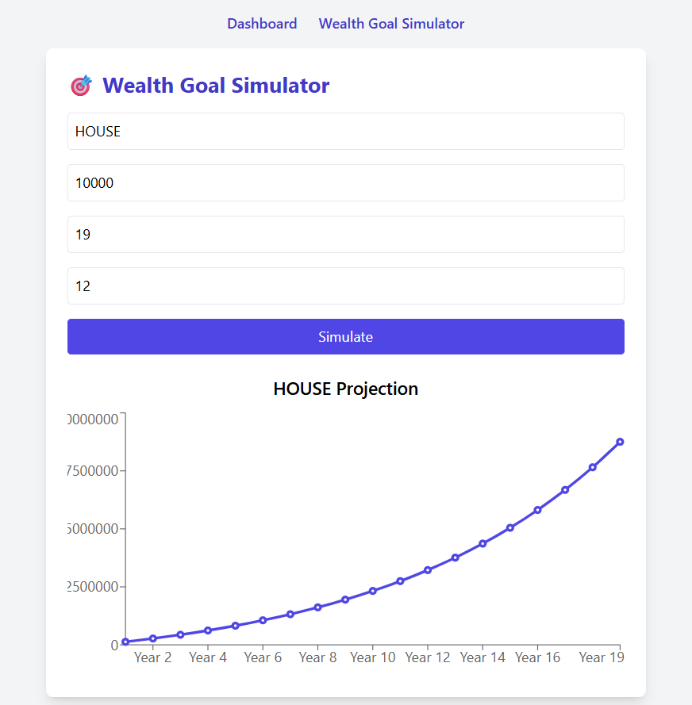
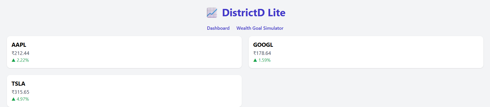

# 📈 DistrictD Lite

DistrictD Lite is a simplified financial dashboard that simulates real-time stock tracking and analytics, designed for demo purposes and inspired by the core services of **DistrictD**.

> ⚡ Powered by React, Node.js, Express, and the Finnhub API

---

## 🔥 Features

- 📊 Real-time stock prices and sparkline charts
- 🧠 "Your personal CFA" assistant tagline
- 📈 Historical data visualization (7-day trends)
- 💼 Built for Wealth & Asset Management prototyping
- 🌐 Responsive UI with TailwindCSS

---

## 📁 Project Structure

districtd-lite/
├── client/ # React frontend with Vite
│ └── src/
│ └── pages/StockDashboard.jsx
├── server/ # Express backend API
│ └── index.js
├── .gitignore
└── README.md

🌟 Future Features (Planned)
📌 Portfolio tracking with performance charts

🔍 Stock search with autocomplete

🧩 Risk profiler

🧠 AI-based financial assistant

🗂️ Sector-wise asset allocation view

📬 Contact
Abhinav Goyal
GitHub: abhinav139
## 📸 Screenshots

### 💻 wealth management view

### stocks 

